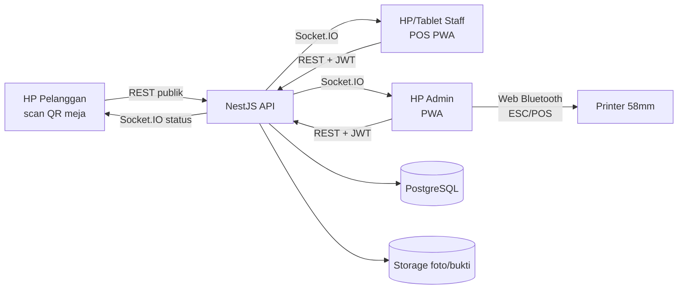
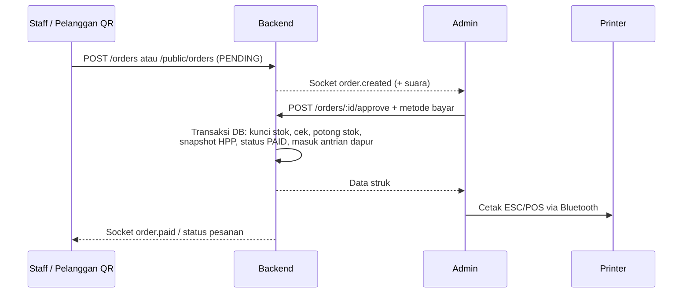
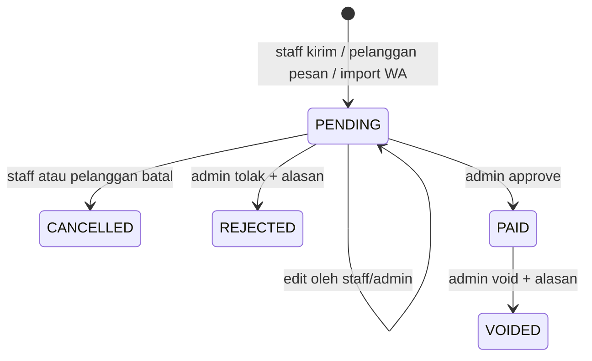
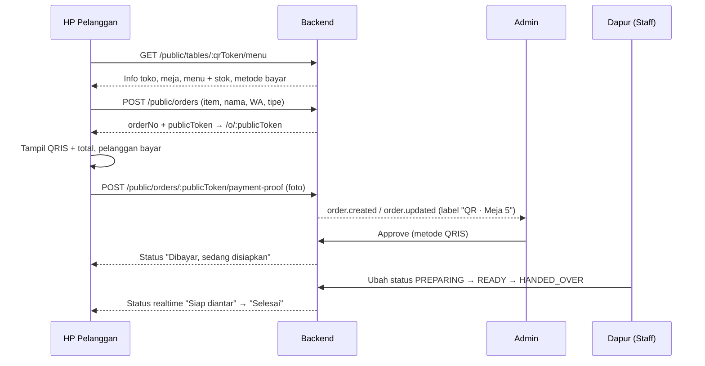
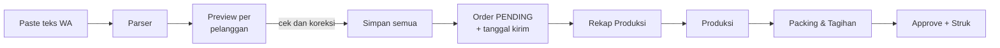

# PRD Bekuin POS v2.0 (Final): Sistem Order, Approval, Self-Order QR, Stok & Keuangan

25 Sep 2026 · @adit · Status: **Final untuk pengembangan** · Menggantikan v1.1 (21 Sep 2026)

## 1. Ringkasan Produk

Bekuin POS adalah aplikasi web (PWA, bisa di-install di HP/tablet) untuk usaha dimsum Bekuin (Frozen & Siap Makan). Aplikasi ini menggantikan rekap order manual yang selama ini diketik satu per satu.

Empat alur utama:

1. **POS Staff:** staff menginput order di layar kasir, lalu order masuk ke antrian approval admin.
2. **Approval Admin:** admin memeriksa order, memilih metode bayar (Cash / QRIS / Transfer), meng-approve, lalu struk tercetak di printer thermal Bluetooth 58mm.
3. **Self-Order QR Meja (baru di v2.0):** pelanggan duduk, scan QR di meja, memesan dan membayar non-tunai (QRIS) dari HP sendiri, lalu memantau status pesanan. Alurnya mirip Mie Gacoan.
4. **Back-office Admin:** kelola menu (CRUD), stok bahan dan produk berbasis resep, HPP otomatis, pre-order massal dari WhatsApp, serta laporan keuangan (penjualan, laba rugi, arus kas, pengeluaran, shift kasir).

**Masalah yang diselesaikan**

- Order diketik dan direkap manual, sehingga rawan salah harga, salah hitung, dan lambat.
- Antrian kasir menumpuk saat ramai karena pelanggan harus datang ke kasir untuk memesan.
- Stok bahan baku dan stok produk tidak sinkron dengan penjualan.
- HPP, margin, dan laba bersih tidak diketahui pasti.
- Tidak ada rekap keuangan harian/bulanan yang rapi (omzet, biaya, uang di laci).

**Tujuan**

1. Staff bisa input order campuran Frozen dan Siap Makan dalam kurang dari 30 detik.
2. Pelanggan bisa memesan dari meja lewat QR tanpa install aplikasi, dan tanpa login, dalam kurang dari 1 menit.
3. Setiap order (POS, QR, WhatsApp) wajib di-approve admin sebelum stok terpotong dan struk dicetak.
4. HPP dihitung otomatis dari resep bertingkat; perubahan harga bahan langsung memperbarui HPP.
5. Setiap perubahan stok dan status order tercatat dan bisa ditelusuri (audit trail).
6. Laporan keuangan harian/bulanan: omzet, HPP, laba kotor, biaya operasional, laba bersih, arus kas per metode bayar, selisih kas.

**Ruang lingkup**

| Masuk rilis v2.0 | Di luar rilis (fase berikutnya) |
| --- | --- |
| Auth + role Admin, Staff; Pelanggan (tamu tanpa login) | Multi-outlet / cabang |
| POS staff, approval, reject, void | QRIS dinamis + konfirmasi otomatis (Midtrans/Xendit) |
| Self-order QR meja + halaman lacak pesanan + antrian dapur | Aplikasi native Android/iOS |
| CRUD menu (kategori, produk, varian, foto, tandai habis) | Loyalty/member, poin, voucher |
| Bahan, resep bertingkat, HPP, kemasan per varian | Input order via AI (voice/foto) |
| Stok masuk, produksi, opname, penyesuaian, mutasi | Integrasi GoFood/GrabFood/ShopeeFood |
| Pre-order massal (tempel pesan WA), rekap produksi, packing, tagihan | Akuntansi penuh (jurnal, neraca) |
| Pengeluaran operasional, shift kasir, laporan keuangan, export | Pembayaran campuran & DP |
| Print struk & label Bluetooth 58mm, cetak QR meja | |

**Perubahan utama dari v1.1**

- Role baru **Pelanggan (tamu)** dengan self-order QR meja, pembayaran QRIS, dan halaman lacak pesanan.
- Modul **Meja & QR**, **Antrian Dapur** (status penyiapan), dan **Pengaturan jam buka / toko tutup**.
- Modul keuangan: **Pengeluaran**, **Shift Kasir** (buka/tutup laci), laporan **Laba Rugi** dan **Arus Kas**.
- CRUD menu diperjelas: foto, deskripsi, urutan, toggle **Habis**, dan kategori yang tampil ke pelanggan.
- Order punya **sumber** (POS, ADMIN, QR_TABLE, WA_IMPORT) dan **tipe** (DINE_IN, TAKEAWAY, PREORDER).
- `fulfillmentStatus` disatukan menjadi `QUEUED → PREPARING → READY → HANDED_OVER` untuk dapur dan packing.
- Urutan sprint diubah: alur jualan (POS + approval + QR) dikerjakan lebih dulu supaya aplikasi cepat dipakai jualan; resep/HPP menyusul.

## 2. Tech Stack dan Arsitektur

Satu monorepo TypeScript: frontend React PWA, backend NestJS, database PostgreSQL dengan Prisma.

| Lapisan | Teknologi | Alasan |
| --- | --- | --- |
| Frontend | React 19 + Vite 7 + TypeScript, vite-plugin-pwa | Bisa di-install di HP/tablet, satu codebase untuk staff, admin, dan pelanggan |
| UI | Tailwind CSS 4 + shadcn/ui + lucide-react | Cepat, konsisten, mobile-first |
| State & data | TanStack Query 5 + Zustand 5 (auth, keranjang) | Cache server, keranjang persisten di localStorage |
| Form & validasi | React Hook Form + Zod 4 (skema di `packages/shared`) | Validasi sama di FE dan BE |
| Backend | Node.js 22 LTS + NestJS 11 | Struktur module/controller/service rapi |
| ORM & DB | Prisma 6 + PostgreSQL 16 | Transaksi kuat untuk stok, Decimal untuk biaya |
| Auth | JWT access (15 menit) + refresh token rotasi (7 hari), bcrypt | Stateless, role guard |
| Realtime | Socket.IO (NestJS Gateway) | Order baru langsung muncul di admin; status pesanan realtime ke pelanggan |
| Print | Web Bluetooth API + builder ESC/POS | Printer thermal 58mm dari Chrome Android |
| QR | `qrcode` (server) | Generate QR meja PNG/SVG untuk dicetak |
| Upload | Disk lokal (dev) → S3-compatible: Cloudflare R2 / Supabase Storage (prod) | Foto menu, bukti bayar, nota belanja |
| Dokumentasi API | Swagger `/api/docs` | Nilai plus portofolio |
| Testing | Jest + Supertest (API), Vitest (shared), Playwright (e2e, opsional) | Uji logika stok, HPP, parser |
| Deploy | Docker Compose; API di VPS/Railway, web di Vercel, DB di Neon/Supabase | Murah dan mudah |
| CI | GitHub Actions: lint, format, typecheck, test, migrasi + seed, build | Standar industri |



Printer terhubung ke HP admin, karena admin yang meng-approve dan mencetak struk.

**Struktur monorepo (pnpm workspace)**

```
pos-bekuin/
  apps/
    api/        NestJS: auth, users, settings, tables, menu (categories, products, variants),
                payment-methods, public (menu & order pelanggan), orders, kitchen, stock,
                ingredients, recipes, costing, purchases, production, opname, customers,
                order-import (parser), production-plan, expenses, cash-sessions, reports,
                uploads, realtime (gateway)
      prisma/   schema.prisma, migrations, seed.ts
    web/        React PWA. features: auth, staff (POS), admin, customer (QR), kitchen,
                stock, master, finance, reports, settings, printer
  packages/
    shared/     Enum, tipe, skema Zod, util (format rupiah, nomor order, normalisasi nama)
  docs/         SETUP.md, fixtures parser
  docker-compose.yml
```

## 3. Role dan Hak Akses

Ada tiga peran. **Staff** membuat order, **Admin** memegang semua keputusan uang dan stok, dan **Pelanggan** adalah tamu tanpa akun yang hanya bisa memesan lewat QR.

| Fitur | Pelanggan (QR) | Staff | Admin |
| --- | --- | --- | --- |
| Login, ganti password | Tidak perlu login | Ya | Ya |
| Lihat menu & stok tersedia | Ya (hanya menu yang aktif & kategori yang ditampilkan ke pelanggan) | Ya | Ya |
| Buat order | Ya (lewat QR meja, sumber `QR_TABLE`) | Ya (POS) | Ya |
| Edit/batal order PENDING | Batal saja, selama belum dikonfirmasi | Milik sendiri | Semua |
| Lihat order | Hanya order sendiri lewat link lacak | Milik sendiri | Semua |
| Unggah bukti bayar QRIS | Ya | Tidak | Ya |
| Approve, pilih metode bayar, reject, approve massal | Tidak | Tidak | Ya |
| Void order PAID | Tidak | Tidak | Ya (wajib alasan) |
| Antrian dapur (ubah status penyiapan) | Tidak | Ya | Ya |
| Cetak/cetak ulang struk & label | Tidak | Tidak | Ya |
| Menu, meja & QR, bahan, resep, pelanggan | Tidak | Tidak | Ya |
| Stok masuk, produksi, opname, penyesuaian | Tidak | Tidak | Ya |
| Pengeluaran, shift kasir, laporan & HPP | Tidak | Tidak | Ya |
| Kelola user & pengaturan toko | Tidak | Tidak | Ya |

- Backend memakai guard global `JwtAuthGuard` + `RolesGuard` dengan dekorator `@Roles('ADMIN')`; endpoint pelanggan ditandai `@Public()` dan dibatasi rate limit. Frontend hanya menyembunyikan menu, bukan pengaman utama.
- Pelanggan **bukan** baris di tabel `users`. Identitasnya adalah `qrToken` meja (saat memesan) dan `publicToken` order (saat melacak). Bila nomor WA diisi, order ditautkan ke tabel `customers`.

## 4. Struktur Menu

Di HP, navigasi memakai bottom tab bar. Di tablet/desktop (mode kasir), navigasi pindah ke sidebar dan layar POS menjadi dua kolom.

**Menu Staff (3 tab)**

1. **Order Baru (POS):** mode **Cepat** (stepper) dan **Tempel Pesan** (paste WhatsApp).
2. **History:** order milik sendiri, filter status dan tanggal kirim, dikelompokkan per pelanggan. Sub-tab **Antrian Dapur**.
3. **Akun:** profil, ganti password, logout.

**Menu Admin (5 tab)**

1. **Dashboard**
   - Omzet, jumlah order, laba kotor hari ini; status shift kasir (buka/tutup)
   - Badge order PENDING per sumber (POS / QR / WA)
   - Peringatan stok menipis, kartu "Besok" (pre-order), grafik penjualan 7 hari
2. **Approval** (badge realtime + suara)
   - Antrian PENDING, terlama di atas, label sumber & meja, bukti bayar QR
   - Detail, ubah item, diskon, pilih metode bayar, **Approve & Print**, Reject, Approve Massal
3. **Order**
   - Semua Transaksi (filter tanggal, status, sumber, staff, metode bayar), detail, cetak ulang, void
   - Buat Order Langsung, **Antrian Dapur**, Tempel Pesan, Rekap Produksi, Packing & Tagihan
4. **Stok**
   - Stok Produk, Stok Bahan Baku, Stok Masuk, Produksi, Stok Opname, Penyesuaian/Waste, Riwayat Mutasi
5. **Lainnya**
   - Master Data: **Menu & Harga** (kategori, produk, varian, foto, habis), **Meja & QR**, Bahan Baku, Resep, Pelanggan, Alias Produk, Metode Bayar, Kategori Pengeluaran
   - Keuangan: **Pengeluaran**, **Shift Kasir**, **Laporan** (Penjualan, Laba Rugi, Arus Kas, Produk Terlaris, Mutasi Stok, Export)
   - Pengguna, Pengaturan Toko (info, struk, QRIS, jam buka, self-order), Printer, Akun

**Halaman Pelanggan (publik, tanpa login)**

1. `/m/:qrToken`: menu meja, berisi header nama toko + nomor meja, tab kategori, kartu produk, dan keranjang.
2. Checkout: nama (wajib), No. WA (opsional), makan di sini / bawa pulang, catatan, metode bayar.
3. `/o/:publicToken`: lacak pesanan realtime, lihat struk digital, tombol "Pesan lagi".

## 5. Spesifikasi Fitur dan Alur Bisnis

Inti sistem: semua order masuk sebagai PENDING, stok baru terpotong saat admin approve, dan perhitungan stok, HPP, serta laporan berjalan otomatis.

### 5.1 POS Staff (Input Order)

Satu layar tanpa pindah halaman, dirancang untuk order campuran Frozen dan Siap Makan.

- Toggle kategori di atas: **Frozen | Siap Makan**. Keranjang tidak reset saat pindah tab. Badge jumlah pack per kategori, misal `Frozen (3)`.
- Kartu produk (foto kecil, nama) dengan baris per varian yang tersedia: `6 pcs Rp22.000 [− 0 +]`. Varian yang tidak ada (Risol 9 pcs) tidak tampil. Produk bertanda **Habis** tampil abu-abu.
- Tap `+` langsung menambah ke keranjang tanpa pop-up. Kolom cari produk untuk menu yang banyak.
- Stok tersedia tampil di kartu ("sisa 42 pcs"). Tombol `+` nonaktif bila stok tidak cukup untuk satu pack lagi. Stok tersedia = stok − pack di keranjang − order PENDING lain dengan tanggal kirim hari ini.
- **HP:** bar bawah tetap (total pack, total rupiah, **Lihat Keranjang**), lalu keranjang terbuka sebagai sheet.
- **Tablet/desktop:** grid produk di kiri, panel keranjang tetap di kanan.
- Keranjang: dikelompokkan FROZEN / SIAP MAKAN, ubah qty, catatan per item, nama pelanggan (autocomplete, opsional), tipe (bawa pulang / makan di sini + pilih meja), tanggal kirim (default hari ini), catatan, lalu **Kirim ke Admin**.
- Keranjang disimpan di localStorage. Staff bisa edit atau batalkan order selama status PENDING.

### 5.2 Approval dan Pembayaran (Admin)



Admin membuka order, memeriksa isi, dan bisa mengubah qty atau menghapus item sebelum approve. Kemudian admin memilih metode bayar:

- **Cash:** input uang diterima, sistem hitung kembalian, tombol nominal cepat (Uang pas, 50.000, 100.000). Hanya bisa bila ada **shift kasir** yang terbuka (5.14).
- **Transfer:** pilih rekening tujuan, input referensi (opsional).
- **QRIS:** tampilkan gambar QRIS statis toko untuk dipindai pelanggan. Untuk order QR, admin melihat **bukti bayar** yang diunggah pelanggan, mengecek mutasi di aplikasi merchant, lalu mengonfirmasi.
- Metode bayar dikelola di master data (bisa tambah ShopeePay, Dana, dll).
- Diskon per order opsional (nominal atau persen), hanya oleh admin.

**Approve & Print** menjalankan satu transaksi database. Bila stok tidak cukup, approve ditolak dan sistem menampilkan item mana yang kurang (bisa dimatikan lewat pengaturan `blockApproveOnLowStock`). Setelah sukses, struk langsung dicetak. Jika printer gagal, order tetap PAID dan tombol cetak ulang tersedia.

### 5.3 Status, Sumber, dan Tipe Order



- **Status bayar** (`status`): seperti diagram di atas.
- **Status penyiapan** (`fulfillmentStatus`), terpisah dari status bayar: `QUEUED → PREPARING → READY → HANDED_OVER`. Untuk dine-in dan takeaway ini adalah alur dapur; untuk pre-order, `READY` berarti sudah dipacking.
- **Sumber** (`source`): `POS`, `ADMIN`, `QR_TABLE`, `WA_IMPORT`. **Tipe** (`type`): `DINE_IN`, `TAKEAWAY`, `PREORDER`.
- Nomor order `BK-YYYYMMDD-0001`, reset tiap hari menurut tanggal WITA, dibuat atomik lewat tabel `daily_counters`.
- **Void** mengembalikan stok lewat mutasi balik (`VOID_RETURN`). Order tidak dihapus dan tetap muncul di laporan sebagai void.
- Setiap perubahan status dicatat di `order_logs` (aksi, siapa, kapan, alasan; `userId` kosong untuk aksi pelanggan).

### 5.4 Logika Potong Stok Saat Approve

Untuk setiap item order:

1. Stok produk (pcs) berkurang sebanyak `qty_pack × pack_size`. Frozen dan Siap Makan memotong stok pcs produk yang sama, karena siap makan digoreng dari stok frozen.
2. Bahan kemasan varian berkurang sebanyak `qty_pack × qty_per_pack`. Frozen: plastik vacuum, stiker, saos. Siap Makan: box, minyak & gas, saos.
3. HPP disimpan sebagai snapshot di `order_items.hpp_per_pack` agar laba historis tidak berubah saat harga bahan naik.
4. Semua mutasi tercatat di `stock_movements` dengan `ref_type = ORDER` dan `ref_id = order.id`.

Baris stok dikunci dengan `SELECT ... FOR UPDATE` di dalam transaksi Prisma (`$transaction` + `$queryRaw`) agar dua approve bersamaan tidak membuat stok minus. Semua perubahan stok **hanya** lewat `StockService`.

### 5.5 Self-Order QR Meja (Pelanggan) — baru

Pelanggan duduk, scan QR di meja, memesan dan membayar dari HP sendiri. Pesanan tetap masuk ke antrian approval admin, sama seperti order staff.



**Alur di HP pelanggan**

1. **Scan QR** membuka `https://<domain>/m/<qrToken>`. Tidak perlu install atau login.
2. **Validasi:** QR tidak dikenal atau meja nonaktif memunculkan pesan "QR tidak valid, hubungi kasir". Bila toko tutup atau self-order dimatikan, muncul "Toko sedang tutup" beserta jam buka.
3. **Menu:** tab kategori (hanya `isCustomerVisible`, misal Siap Makan dan Frozen untuk dibawa pulang), kartu produk dengan foto, deskripsi, harga per varian, dan label **Habis** bila stok kurang atau ditandai habis.
4. **Keranjang** disimpan di localStorage per meja. Ada batas total order (`qrMaxOrderTotal`, default Rp1.000.000).
5. **Checkout:** nama (wajib, untuk dipanggil), No. WA (opsional), **Makan di sini / Bawa pulang**, catatan, metode bayar.
   - `QRIS_ONLY` (default): pelanggan wajib bayar QRIS.
   - `QRIS_OR_CASHIER`: ada pilihan tambahan "Bayar di kasir".
6. **Pembayaran QRIS:** halaman lacak menampilkan gambar QRIS statis toko, **total yang harus dibayar**, dan nomor order. Pelanggan membayar dari aplikasi e-wallet/m-banking, lalu mengunggah screenshot bukti (opsional tapi dianjurkan).
7. **Lacak pesanan** `/o/<publicToken>` (realtime lewat Socket.IO room `order:<publicToken>`):

| Status sistem | Tampilan ke pelanggan |
| --- | --- |
| PENDING | "Menunggu konfirmasi pembayaran" + QRIS + tombol unggah bukti + tombol batal |
| PAID + QUEUED/PREPARING | "Pembayaran diterima, pesanan sedang disiapkan" |
| PAID + READY | "Pesanan siap, segera diantar ke meja" / "Silakan ambil di kasir" |
| PAID + HANDED_OVER | "Selesai. Terima kasih!" + struk digital |
| REJECTED | "Pesanan ditolak: <alasan>" |
| CANCELLED | "Pesanan dibatalkan" |

8. Tombol **Pesan lagi** kembali ke menu meja yang sama.

**Aturan dan keamanan**

- Harga, stok, dan total **selalu dihitung ulang di server**. Isian harga dari klien diabaikan.
- Rate limit: maksimal 5 order per 10 menit per meja + IP, dan maksimal 3 order PENDING terbuka per meja.
- `qrToken` berupa 12 karakter acak (bukan nomor meja), sehingga tidak bisa ditebak. Admin bisa **ganti QR** (rotate) bila QR lama disalahgunakan.
- Pelanggan hanya bisa membatalkan order miliknya selama PENDING dan belum ada bukti bayar.
- Bukti bayar: gambar JPG/PNG/WebP maksimal 5 MB, dikompres di klien sebelum diunggah.
- Order QR memotong stok saat approve, sama seperti order lain. Menu pelanggan menampilkan "Habis" bila stok tersedia < 1 pack.

**Di sisi admin dan staff**

- Order QR muncul di Approval dengan label **QR · Meja 5**, badge "Bukti bayar ✓" bila sudah unggah, dan suara berbeda.
- Setelah approve, order masuk **Antrian Dapur** (5.6).
- Order QR yang PENDING lebih dari 30 menit tanpa bukti bayar diberi tanda "Kedaluwarsa?" agar admin bisa menolaknya.

**Fase berikutnya:** QRIS dinamis per order lewat payment gateway (Midtrans/Xendit). Dengan itu, status PAID terisi otomatis dari webhook tanpa perlu konfirmasi manual admin.

### 5.6 Meja & QR, dan Antrian Dapur — baru

**Meja & QR (Admin > Lainnya > Meja & QR)**

- CRUD meja: kode (`M01`), nama (`Meja 1`), aktif/nonaktif, urutan. Ada juga satu QR umum `TAKEAWAY` untuk ditempel di kasir atau etalase.
- Setiap meja punya `qrToken` acak. Tombol: **Lihat QR**, **Unduh PNG**, **Ganti QR** (token baru; QR lama langsung tidak berlaku), dan **Cetak semua QR**.
- Cetak semua QR menghasilkan halaman A4 siap print: kartu per meja berisi logo, "Scan untuk pesan", nomor meja, dan QR. Bisa juga dicetak ke printer 58mm.

**Antrian Dapur (Staff > History > Dapur, Admin > Order > Antrian Dapur)**

- Kolom **Antre / Disiapkan / Siap**. Kartu berisi nomor order, meja atau nama, item (Siap Makan diberi tanda "Goreng"), dan waktu sejak dibayar.
- Tap kartu untuk memajukan status. Waktu `preparingAt`, `readyAt`, dan `handedOverAt` tercatat untuk laporan kecepatan layanan.
- Realtime lewat event `order.fulfillment`, dan pelanggan QR ikut menerima update.

### 5.7 Menu & Harga (CRUD) — diperjelas

- **Kategori penjualan:** kode, nama, urutan, aktif, dan **tampil ke pelanggan** (`isCustomerVisible`).
- **Produk:** nama, deskripsi, foto (unggah, dikompres ke WebP ≤ 200 KB), urutan tampil, stok minimum, aktif (soft delete), dan **Habis** (toggle cepat tanpa menghapus). Alias produk dipakai parser WA.
- **Varian:** produk × kategori × ukuran pack × harga. Kemasan per pack, HPP, dan margin tampil otomatis setelah Sprint 4.
- Validasi: kombinasi produk + kategori + pack harus unik; harga > 0. Varian yang sudah pernah dipakai order tidak bisa dihapus, hanya dinonaktifkan.
- Perubahan harga tidak mengubah order lama, karena harga disimpan sebagai snapshot di `order_items`.

### 5.8 Master Bahan, Resep Bertingkat, dan HPP

**Bahan baku:** nama, tipe (`RAW`, `SEMI_FINISHED`, `PACKAGING`), satuan dasar (gram, ml, pcs), kemasan beli dan isinya, harga beli terakhir, harga rata-rata, stok, dan stok minimum.

**Resep bertingkat:** resep bisa memakai bahan mentah atau hasil resep lain.

- Resep **setengah jadi** menghasilkan bahan `SEMI_FINISHED`, misal Adonan Dasar (hasil 1.200 g) dan Kulit Risol (hasil 50 pcs).
- Resep **produk** mendefinisikan komposisi per 1 pcs, misal Udang Keju = 25 g adonan + 7 g keju oles + 10 g tepung roti.
- Bahan kemasan menempel di **varian** (per pack), bukan di resep produk.

```latex
\text{HPP}_{\text{pack}} = \text{pack\_size} \times \sum_{i} (\text{qty}_i \times \text{biaya\_per\_unit}_i) + \sum_{j} (\text{qty}_j \times \text{biaya\_kemasan}_j)
```

- Biaya per unit bahan setengah jadi = total biaya bahan resep ÷ hasil resep.
- HPP dihitung ulang otomatis saat harga bahan berubah. Resep melingkar ditolak.
- Halaman varian menampilkan HPP, margin rupiah, dan margin persen.
- **Pembulatan:** tabel 7.5 memakai HPP per pcs yang dibulatkan ke **Rp10 terdekat** (misal Udang Keju 2.156,69 → 2.160). `CostingService` menyimpan angka presisi (Decimal), dan tampilan/uji tabel memakai pembulatan yang sama.

### 5.9 Stok Masuk (Belanja Bahan)

- Admin input tanggal, supplier (opsional), daftar bahan, jumlah kemasan, harga total, dan foto nota (opsional).
- Sistem mengonversi ke satuan dasar. Contoh: 2 pack keju oles × 2 kg = 4.000 g.
- Harga rata-rata diperbarui dengan **weighted average**: (stok lama × harga lama + qty baru × harga baru) ÷ (stok lama + qty baru).
- Belanja bahan tercatat sebagai **kas keluar** di laporan arus kas. Biayanya tidak dihitung lagi sebagai pengeluaran operasional, karena sudah masuk ke HPP.

### 5.10 Produksi

- **Produksi setengah jadi:** pilih resep (misal Adonan Dasar) dan jumlah batch. Bahan mentah berkurang, stok adonan bertambah 1.200 g per batch.
- **Produksi produk:** pilih produk dan jumlah pcs (misal Udang Keju 60 pcs). Sistem menampilkan kebutuhan bahan dan stoknya, lalu memotong adonan, keju, tepung roti, dan menambah 60 pcs Udang Keju.
- Produksi ditolak bila bahan kurang, disertai daftar kekurangan.
- Hasil aktual boleh berbeda dari teori (misal adonan jadi 1.180 g). Selisihnya dicatat sebagai `yieldVariance`.
- `products.avgCostPerPcs` diperbarui setiap produksi (weighted average dari biaya aktual).

### 5.11 Stok Opname, Penyesuaian, dan Waste

- Admin membuat sesi opname dengan memilih produk dan/atau bahan. Sistem menampilkan stok sistem, admin menginput stok fisik, lalu sistem menghitung selisih dan nilai rupiahnya.
- Draft bisa disimpan. Saat difinalkan, stok disesuaikan dengan mutasi `OPNAME_ADJUST`.
- Penyesuaian manual (`MANUAL_ADJUST`) dan barang rusak/basi (`WASTE`) wajib disertai alasan. Nilai waste masuk laporan sebagai kerugian.

### 5.12 Pre-Order Massal via Tempel Pesan WhatsApp

Staff menempel teks pesanan WhatsApp apa adanya. Sistem memecahnya menjadi satu order per pelanggan lengkap dengan total harga, lalu staff memeriksa dan menyimpan semuanya dengan satu tombol.



**Aturan parser** (berbasis aturan, tanpa AI, bisa diuji; detail di `.claude/skills/bekuin-parser/SKILL.md`)

| # | Aturan | Contoh | Hasil |
| --- | --- | --- | --- |
| 1 | Baris tanpa nama produk dan tanpa penanda item = nama pelanggan | `Bu kusuma` | Pelanggan Bu Kusuma |
| 2 | Baris berawalan `-`, `•`, `.`, `*`, atau angka + titik = item | `. Udang keju (6 pcs)` | Satu item |
| 3 | Nama produk dicocokkan lewat alias, lalu kecocokan token, lalu toleran typo (jarak edit ≤ 2) | `Dimsam ori` | Dimsum Ori |
| 4 | Angka 6 atau 9 dengan `pcs`/`psc`/`pc` (kurung opsional) = ukuran pack | `( 9 pcs)` | Pack 9 |
| 5 | `2x` atau `x2` = jumlah pack; tanpa itu = 1 | `Udang keju 6 pcs x2` | 2 pack |
| 6 | Kategori bawaan Frozen. Kata `mateng`, `matang`, `digoreng`, `siap makan` = Siap Makan | `Mahayuda (mateng/digoreng)` | Semua item Siap Makan |
| 7 | Kata kategori di baris pelanggan berlaku ke semua itemnya; di baris item hanya untuk item itu | `. Udang keju 6 pcs mateng` | Hanya item itu |
| 8 | Baris awal berisi `order`/`oderan`/`pesanan` = header; `besok`/`bsk`/`lusa` = tanggal kirim | `Oderan bsk` | Tanggal kirim besok |
| 9 | Pelanggan yang sama muncul dua kali digabung jadi satu order | `Bu Ayu` dua kali | Satu order, ditandai |

Kata "goreng" yang merupakan bagian nama produk (Dimsum Goreng Keju) tidak dianggap penanda kategori. Deteksi kategori dilakukan setelah nama produk cocok, dan hanya pada sisa teks baris.

**Preview:** satu kartu per pelanggan. Status baris **Hijau** (cocok), **Kuning** (ukuran ditebak atau fuzzy, boleh disimpan setelah dilihat), **Merah** (tidak dikenali atau ukuran tidak tersedia, wajib dikoreksi). Semua isian bisa diedit inline. Tombol "Ingat sebagai alias" menyimpan ejaan untuk pesanan berikutnya. Bar bawah menampilkan ringkasan dan tombol **Simpan semua**, yang nonaktif selama masih ada baris merah.

**Simpan** membuat semua order PENDING (`source = WA_IMPORT`, `type = PREORDER` bila tanggal kirim > hari ini) dalam satu transaksi, dengan `batchId` yang sama. Teks asli disimpan di `order_batches.raw_text`.

**Aturan stok pre-order:** order dengan tanggal kirim setelah hari ini tidak dicek stoknya saat input. Stok tetap dicek saat approve.

**Uji terima:** contoh pesanan nyata (12 pelanggan) di `docs/fixtures/wa-order-sample.txt` harus menghasilkan 12 order, 21 pack, dan Rp510.000, dengan seluruh item Mahayuda berkategori Siap Makan.

### 5.13 Pelanggan, Tanggal Kirim, Rekap Produksi, Packing & Tagihan

**Pelanggan & tanggal kirim**

- Setiap order punya tanggal kirim (default hari ini) dan bisa terhubung ke data pelanggan. Pelanggan tersimpan otomatis saat pertama kali diinput.
- Autocomplete nama; No. WA dan catatan opsional. Order tanpa nama tetap boleh dan tidak membuat data pelanggan.
- Tombol **Order ulang** menyalin order terakhir pelanggan ke keranjang.
- Admin bisa menggabungkan pelanggan ganda ("Bu Sri" dan "Ibu Sri").
- Filter tanggal kirim tersedia di History, Approval, dan Semua Transaksi. Struk dan label memuat nama pelanggan dan tanggal kirim.

**Rekap Produksi** (pilih tanggal kirim)

```latex
\text{Perlu produksi}_p = \max\left(0,\ \sum_{o \in \text{PENDING}} \sum_{i} \text{qty}_i \times \text{pack\_size}_i - \text{stok\_pcs}_p\right)
```

1. Ambil order PENDING pada tanggal kirim terpilih. PAID tidak dihitung karena stoknya sudah terpotong; CANCELLED, REJECTED, dan VOIDED diabaikan.
2. Kelompokkan per produk dan varian, lalu jumlahkan pcs = qty × ukuran pack. Kurangi dengan stok pcs.
3. Uraikan resep per pcs menjadi adonan, keju, tepung roti, dan kulit. Kebutuhan adonan dibagi hasil batch (1.200 g) lalu **dibulatkan ke atas**, kemudian diuraikan menjadi bahan mentah.
4. Tambahkan kemasan per pack, kurangi stok bahan, dan sisanya menjadi **daftar belanja** dengan estimasi biaya.
5. Siap Makan dihitung sebagai pcs frozen, dan juga ditampilkan sebagai daftar tugas "Digoreng hari kirim".

Contoh uji dari pesanan 12 pelanggan (stok awal 0): 138 pcs, adonan 3.540 g (3 batch), keju oles 705 g, tepung roti 750 g, kulit dimsum 51, kulit lumpia 24, dan kemasan: vacuum 18, stiker 18, saos 21, box 3, minyak & gas 3.

Aksi: **Buat produksi dari rekap** (form produksi terisi otomatis), **Cetak rekap** (58mm), **Salin teks** (untuk WhatsApp).

**Packing, Tagihan, dan Approve Massal**

- Daftar packing: satu kartu per pelanggan, item Siap Makan bertanda "Goreng dulu", progres "8 dari 12 siap", filter tanggal kirim dan status. Status packing memakai `fulfillmentStatus` (`QUEUED → READY → HANDED_OVER`).
- Label 58mm per pelanggan (nama, tanggal kirim, isi, FROZEN/MATANG) dan tombol **Cetak semua label**.
- Tagihan: total per pelanggan dan total harian. **Salin tagihan** menghasilkan teks siap kirim ke WhatsApp.
- **Approve massal:** centang beberapa order, pilih satu metode bayar, lalu setiap order diproses dalam transaksi sendiri. Hasil ditampilkan per order (berhasil/gagal + alasan), dan order yang gagal tidak menggagalkan yang lain. Untuk cash yang perlu kembalian, admin tetap memakai approve satuan.

### 5.14 Keuangan: Pengeluaran dan Shift Kasir — baru

**Pengeluaran operasional**

- Input: tanggal, kategori (Sewa, Listrik & Air, Gaji, Gas, Transport & Ongkir, Marketing, Lain-lain; bisa ditambah), nominal, dibayar dari (Cash laci / Transfer), catatan, foto nota.
- Pengeluaran cash saat shift terbuka otomatis tertaut ke shift itu dan mengurangi uang yang seharusnya ada di laci.
- Belanja bahan **tidak** diinput di sini, tetapi lewat Stok Masuk (5.9), supaya tidak dihitung dua kali.

**Shift kasir (buka/tutup laci)**

- **Buka shift:** admin mengisi modal awal (misal Rp200.000). Hanya satu shift yang bisa terbuka dalam satu waktu. Approve dengan metode Cash wajib ada shift terbuka.
- **Tutup shift:** sistem menghitung `kas seharusnya = modal awal + penjualan cash − pengeluaran cash`. Admin menginput uang fisik hasil hitung, lalu sistem mencatat **selisih** (lebih/kurang) beserta catatannya.
- Rekap tutup shift bisa dicetak ke 58mm: jumlah order, omzet per metode bayar, per kategori, void, pengeluaran, kas seharusnya, kas fisik, dan selisih.

### 5.15 Laporan

Semua laporan punya filter periode (hari ini, kemarin, 7 hari, bulan ini, custom), bisa di-export ke CSV/XLSX, dan dihitung menurut tanggal WITA.

| Laporan | Isi |
| --- | --- |
| **Penjualan** | Omzet kotor, diskon, omzet bersih, jumlah order, rata-rata per order; per metode bayar, per sumber (POS/QR/WA), per staff, per jam (jam ramai) |
| **Laba Rugi** | Omzet bersih − HPP (snapshot) = **Laba kotor**; − Pengeluaran operasional − Waste = **Laba bersih**; per bulan, dengan margin % |
| **Laba per produk** | Omzet, HPP, laba kotor per produk, per varian, per kategori (Frozen vs Siap Makan) |
| **Arus Kas** | Kas masuk per metode bayar (penjualan PAID) − kas keluar (belanja bahan + pengeluaran) = arus kas bersih; saldo cash dari shift |
| **Produk Terlaris** | Ranking berdasarkan pack, pcs, dan omzet |
| **Mutasi Stok** | Per bahan atau produk, per tipe mutasi, dengan nilai rupiah |
| **Shift Kasir** | Riwayat shift, selisih kas per shift |
| **Rekap Harian (Tutup Hari)** | Ringkasan hari ini, bisa dicetak ke printer 58mm |
| **Layanan QR** | Jumlah order QR, rata-rata waktu bayar → siap → diserahkan |

Order VOIDED dan REJECTED tidak dihitung sebagai omzet, tetapi jumlahnya ditampilkan terpisah.

### 5.16 Notifikasi

- **Order baru** (POS/QR/WA): suara + badge di admin lewat Socket.IO, plus Web Push bila aplikasi berjalan di background.
- **Order approved/rejected:** notifikasi ke staff pembuat, dan halaman lacak pelanggan ikut berubah.
- **Pesanan siap:** kartu pelanggan QR berubah menjadi "Siap".
- **Stok di bawah minimum:** badge merah di Dashboard dan menu Stok.

### 5.17 Pengaturan Toko

Nama toko, tagline, alamat, No. WA, logo, footer struk, gambar QRIS statis, lebar kertas (32 karakter). Lalu: **toko buka/tutup** (toggle cepat), **jam buka per hari**, **self-order QR aktif/nonaktif**, mode bayar QR (`QRIS_ONLY` / `QRIS_OR_CASHIER`), batas total order QR, dan blokir approve bila stok kurang.

## 6. Model Data

Skema lengkap ada di `apps/api/prisma/schema.prisma` (sudah dibuat di Sprint 0), dengan 29 tabel dalam 6 kelompok.

| Kelompok | Tabel | Fungsi |
| --- | --- | --- |
| Auth | `users`, `refresh_tokens` | Akun dan sesi login (refresh token disimpan sebagai hash) |
| Toko | `settings`, `dining_tables`, `payment_methods` | Info toko, meja & QR, metode bayar |
| Master & Menu | `sales_categories`, `products`, `product_variants`, `variant_packaging`, `product_aliases` | Menu jual, harga, kemasan, alias parser |
| Master & Menu | `ingredients`, `recipes`, `recipe_lines`, `customers` | Bahan, resep bertingkat, pelanggan |
| Order | `orders`, `order_items`, `order_logs`, `order_batches`, `daily_counters` | Transaksi, snapshot harga & HPP, riwayat status, batch WA, nomor harian |
| Stok | `stock_movements`, `purchases`, `purchase_items`, `productions`, `production_lines`, `stock_opnames`, `stock_opname_items` | Buku besar mutasi dan dokumen stok |
| Keuangan | `expense_categories`, `expenses`, `cash_sessions` | Pengeluaran operasional dan shift kasir |

**Kolom penting di `orders`**

`orderNo`, `publicToken` (lacak pelanggan), `status`, `source`, `type`, `fulfillmentStatus`, `customerId`/`customerName`/`customerPhone`, `tableId`, `deliveryDate`, `batchId`, `subtotal`/`discount`/`total`/`hppTotal`, `paymentMethodId`/`paidAmount`/`changeAmount`/`paymentRef`/`paymentProofUrl`, `reason`, `createdById` (null untuk pelanggan QR), `approvedById`/`approvedAt`, `cashSessionId`, `preparingAt`/`readyAt`/`handedOverAt`.

**Aturan penting**

- Uang jual disimpan sebagai `Int` rupiah. Biaya per gram/ml/pcs disimpan `Decimal(14,4)`.
- Snapshot HPP order = `pack_size × avgCostPerPcs + biaya kemasan`. Sebelum ada produksi, dipakai HPP teoretis dari resep.
- `stock_movements` tidak pernah di-update atau dihapus, dan `balanceAfter` menyimpan saldo setelah mutasi.
- Data master memakai soft delete (`isActive`), tidak dihapus permanen.
- Waktu disimpan UTC. Tanggal bisnis (nomor order, laporan) memakai zona **Asia/Makassar (WITA)**.

## 7. Data Awal (Seeder)

Seeder (`pnpm db:seed`) aman dijalankan berulang dan memuat: 2 akun, 3 metode bayar, 2 kategori, 7 kategori pengeluaran, 7 meja QR (M01–M06 + TAKEAWAY), 21 bahan + 2 bahan setengah jadi, 2 resep setengah jadi, 5 resep produk, 16 varian beserta kemasan, dan alias produk.

### 7.1 Bahan Baku

| Bahan | Tipe | Kemasan beli | Harga beli (Rp) | Biaya per unit (Rp) |
| --- | --- | --- | --- | --- |
| Ayam | RAW | 1.000 g | 60.000 | 60/g |
| Putih telur | RAW | 1 pcs | 2.000 | 2.000/pcs |
| Gula | RAW | 1.000 g | 17.000 | 17/g |
| Bumbu adonan (paket) | RAW | 1 paket | 7.000 | 7.000/paket |
| Tepung tapioka | RAW | 1.000 g | 15.000 | 15/g |
| Keju oles | RAW | 2.000 g | 140.000 | 70/g |
| Kulit lumpia | RAW | 50 pcs | 12.000 | 240/pcs |
| Kulit dimsum | RAW | 100 pcs | 15.000 | 150/pcs |
| Tepung terigu | RAW | 1.000 g | 10.000 | 10/g |
| Susu cair | RAW | 1.000 ml | 20.000 | 20/ml |
| Telur | RAW | 1 pcs | 2.000 | 2.000/pcs |
| Smoked beef | RAW | 50 slice | 70.000 | 1.400/slice |
| Mayones | RAW | 1.000 g | 25.000 | 25/g |
| Kental manis | RAW | 400 g | 20.000 | 50/g |
| Keju blok | RAW | 2.000 g | 90.000 | 45/g |
| Tepung roti | RAW | 1.000 g | 18.000 | 18/g |
| Plastik vacuum | PACKAGING | 1 pcs | 1.000 | 1.000/pcs |
| Stiker logo | PACKAGING | 1 pcs | 300 | 300/pcs |
| Saos | PACKAGING | 1 pcs | 2.000 | 2.000/pcs |
| Box siap makan | PACKAGING | 1 pcs | 1.000 | 1.000/pcs |
| Minyak & gas | PACKAGING | 1 porsi goreng | 1.000 | 1.000/porsi |

Bumbu adonan dicatat sebagai satu paket Rp7.000 per resep agar input sederhana.

### 7.2 Resep Setengah Jadi

| Resep | Komposisi per batch | Hasil | Biaya batch (Rp) | Biaya per unit (Rp) |
| --- | --- | --- | --- | --- |
| Adonan Dasar | Ayam 1.000 g, putih telur 1, gula 33 g, bumbu 1 paket, tapioka 120 g | 1.200 g | 71.361 | 59,47/g |
| Kulit Risol | Terigu 500 g, tapioka 120 g, susu 250 ml, air 1.000 ml (tanpa biaya), telur 2 | 50 pcs | 15.800 | 316/pcs |

### 7.3 Resep Produk (per 1 pcs)

| Produk | Komposisi per pcs | HPP per pcs (Rp) | Dibulatkan Rp10 |
| --- | --- | --- | --- |
| Dimsum Goreng Keju | Kulit lumpia 2, adonan 26 g, keju oles 10 g | 2.726 | 2.730 |
| Udang Keju | Adonan 25 g, keju oles 7 g, tepung roti 10 g | 2.157 | 2.160 |
| Risol Mayo | Kulit risol 1, telur 0,125, smoked beef 0,2 slice, keju blok 10 g, mayo 20 g, kental manis 0,2 g, tepung roti 10 g | 1.986 | 1.990 |
| Dimsum Keju | Kulit dimsum 1, adonan 25 g, keju oles 5 g | 1.987 | 1.990 |
| Dimsum Ori | Kulit dimsum 1, adonan 27 g | 1.756 | 1.760 |

### 7.4 Kemasan per Pack

| Kategori | Bahan per pack | Biaya per pack (Rp) |
| --- | --- | --- |
| Frozen | Plastik vacuum 1, stiker 1, saos 1 | 3.300 |
| Siap Makan | Box 1, minyak & gas 1, saos 1 | 4.000 |

### 7.5 Varian, Harga, dan Margin

HPP = pack × HPP per pcs (dibulatkan Rp10) + kemasan.

| Varian | Harga jual (Rp) | HPP (Rp) | Margin (Rp) | Margin (%) |
| --- | --- | --- | --- | --- |
| Udang Keju Frozen 6 | 22.000 | 16.260 | 5.740 | 26 |
| Dimsum Goreng Keju Frozen 6 | 28.000 | 19.680 | 8.320 | 30 |
| Udang Keju Siap Makan 6 | 24.000 | 16.960 | 7.040 | 29 |
| Udang Keju Frozen 9 | 33.000 | 22.740 | 10.260 | 31 |
| Dimsum Ori Frozen 6 | 20.000 | 13.860 | 6.140 | 31 |
| Dimsum Ori Siap Makan 6 | 21.000 | 14.560 | 6.440 | 31 |
| Dimsum Keju Frozen 6 | 22.000 | 15.240 | 6.760 | 31 |
| Dimsum Keju Siap Makan 6 | 23.000 | 15.940 | 7.060 | 31 |
| Dimsum Goreng Keju Siap Makan 6 | 30.000 | 20.380 | 9.620 | 32 |
| Udang Keju Siap Makan 9 | 35.000 | 23.440 | 11.560 | 33 |
| Dimsum Ori Frozen 9 | 30.000 | 19.140 | 10.860 | 36 |
| Dimsum Ori Siap Makan 9 | 31.000 | 19.840 | 11.160 | 36 |
| Dimsum Keju Frozen 9 | 33.000 | 21.210 | 11.790 | 36 |
| Dimsum Keju Siap Makan 9 | 34.000 | 21.910 | 12.090 | 36 |
| Risol Mayo Frozen 6 | 28.000 | 15.240 | 12.760 | 46 |
| Risol Mayo Siap Makan 6 | 30.000 | 15.940 | 14.060 | 47 |

**Akun seeder:** `admin` / `admin12345` dan `staff` / `staff12345` (bisa diubah di `.env`). Password awal **wajib diganti** saat login pertama.

## 8. Struk, Label, QR, dan Printing

Struk dibuat 32 karakter per baris (font A, kertas 58mm) dan dikirim sebagai perintah ESC/POS dari HP admin lewat Web Bluetooth.

```
            BEKUIN
   Frozen Food - Siap Makan
      WA 085743635709
--------------------------------
No    : BK-20260921-0012
Tgl   : 21/09/2026 14:32
Kasir : Rina  Admin: Adit
Plgn  : Bu Sari      Meja: 05
Sumber: QR Meja
--------------------------------
FROZEN
Udang Keju 6pcs
  2 x 22.000            44.000
Dimsum Ori 9pcs
  1 x 30.000            30.000
SIAP MAKAN
Risol Mayo 6pcs
  1 x 30.000            30.000
--------------------------------
Subtotal               104.000
Diskon                       0
TOTAL                  104.000
QRIS                   104.000
--------------------------------
   Terima kasih sudah order!
  Simpan frozen di freezer -18C
```

**Implementasi**

- Modul `printer` di frontend (sudah ada spike di Sprint 0): `connectPrinter()`, `printBytes()`, dan builder `EscPosBuilder` (init, align, bold, double size untuk TOTAL, pair kiri-kanan, feed).
- Data dikirim per potongan kecil (128 byte + jeda 20 ms) agar tidak gagal di printer BLE murah.
- Reconnect otomatis ke printer terakhir, dan logo toko opsional (bitmap monokrom 384 px).
- Fallback bila Web Bluetooth tidak didukung: aplikasi RawBT (Android) atau dialog print browser.
- Syarat: Chrome Android, HTTPS (atau localhost), dan printer mendukung **BLE**. Wajib dites dengan printer yang dipakai.
- **Printer Bekuin: Axelpos/Iware C58BT.** Spesifikasinya: thermal 58mm, 384 dot/baris (cocok dengan 32 karakter font A), perintah ESC/POS, Bluetooth + USB, port laci uang RJ11. Printer ini diiklankan kompatibel dengan iOS, yang biasanya berarti mendukung BLE. Tetap perlu dibuktikan lewat tes print. Bila ternyata hanya Bluetooth Classic, cetak lewat aplikasi RawBT.
- Builder yang sama dipakai untuk label packing, rekap produksi, tutup shift/tutup hari, dan kartu QR meja (QR sebagai raster bitmap).

## 9. API Endpoint

REST dengan prefix `/api/v1`, respons JSON, validasi DTO class-validator, dan Swagger di `/api/docs`.

| Modul | Method & path | Role | Keterangan |
| --- | --- | --- | --- |
| Health | `GET /health` | Publik | Cek API + DB ✅ |
| Auth | `POST /auth/login` | Publik | Rate limit 5x/menit ✅ |
| Auth | `POST /auth/refresh`, `POST /auth/logout` | Publik (bawa refresh token) | Rotasi dan cabut refresh token ✅ |
| Auth | `GET /auth/me`, `PATCH /auth/password` | Login | Profil dan ganti password ✅ |
| Users | `GET/POST/PATCH/DELETE /users` | Admin | CRUD user, reset password |
| Settings | `GET/PATCH /settings` | Admin | Info toko, struk, QRIS, jam buka, self-order |
| Uploads | `POST /uploads` | Login | Foto menu, nota (validasi tipe & ukuran) |
| Tables | `GET/POST/PATCH/DELETE /tables`, `POST /tables/:id/rotate-qr`, `GET /tables/:id/qr.png`, `GET /tables/qr-sheet` | Admin | Meja & QR |
| Menu | `GET/POST/PATCH /sales-categories` | Admin | Kategori + tampil ke pelanggan |
| Menu | `GET/POST/PATCH/DELETE /products`, `PATCH /products/:id/availability` | Admin | Produk, foto, toggle habis |
| Menu | `POST/PATCH/DELETE /products/:id/variants` | Admin | Varian + kemasan, balikan HPP & margin |
| Payment | `GET/POST/PATCH /payment-methods` | Admin | Metode bayar |
| Katalog | `GET /catalog` | Login | Menu aktif + varian + stok tersedia (layar POS) |
| **Publik** | `GET /public/tables/:qrToken/menu` | Publik | Info toko, meja, status buka, menu pelanggan, metode bayar |
| **Publik** | `POST /public/orders` | Publik (rate limit) | Body: `qrToken`, items, nama, WA, tipe, catatan, metode. Balikan `orderNo`, `publicToken` |
| **Publik** | `GET /public/orders/:publicToken` | Publik | Status + item + total + QRIS |
| **Publik** | `POST /public/orders/:publicToken/payment-proof`, `POST /public/orders/:publicToken/cancel` | Publik | Unggah bukti, batal |
| Orders | `POST /orders` | Login | Buat order PENDING (POS) |
| Orders | `GET /orders?status=&source=&deliveryDate=&fulfillment=`, `GET /orders/:id` | Login | Staff hanya melihat miliknya |
| Orders | `PATCH /orders/:id`, `POST /orders/:id/cancel` | Login | Hanya saat PENDING |
| Orders | `POST /orders/:id/approve` | Admin | Body: paymentMethodId, paidAmount, discount, paymentRef |
| Orders | `POST /orders/bulk-approve` | Admin | Body: `orderIds[]`, `paymentMethodId`; hasil per order |
| Orders | `POST /orders/:id/reject`, `POST /orders/:id/void` | Admin | Wajib alasan |
| Orders | `GET /orders/:id/receipt`, `/label`, `/invoice-text` | Admin | Data struk, label, teks tagihan |
| Kitchen | `GET /kitchen/queue`, `PATCH /orders/:id/fulfillment` | Login | Antrian dapur, ubah status penyiapan |
| Import | `POST /orders/import/preview`, `POST /orders/import` | Login | Tempel pesan WA |
| Customers | `GET/POST/PATCH /customers`, `GET /customers/suggest?q=`, `POST /customers/:id/merge` | Login / Admin (merge) | Pelanggan |
| Alias | `GET/POST/DELETE /product-aliases` | Admin (POST juga Staff) | Alias produk |
| Ingredients | `GET/POST/PATCH/DELETE /ingredients` | Admin | Bahan baku |
| Recipes | `GET/POST/PATCH /recipes`, `GET /recipes/:id/cost` | Admin | Resep + rincian biaya |
| Stock | `GET /stock/products`, `GET /stock/ingredients`, `GET /stock/movements`, `POST /stock/adjust` | Admin | Stok, mutasi, penyesuaian/waste |
| Purchases | `GET/POST /purchases` | Admin | Stok masuk |
| Production | `POST /productions/preview`, `POST /productions` | Admin | Produksi |
| Opname | `GET/POST /opnames`, `PATCH /opnames/:id`, `POST /opnames/:id/finalize` | Admin | Stok opname |
| Plan | `GET /reports/production-plan?date=` | Admin | Rekap produksi + daftar belanja |
| Packing | `GET /orders/packing-list?date=` | Admin | Daftar packing |
| Expenses | `GET/POST/PATCH/DELETE /expenses`, `GET/POST/PATCH /expense-categories` | Admin | Pengeluaran |
| Cash | `GET /cash-sessions/current`, `POST /cash-sessions/open`, `POST /cash-sessions/:id/close`, `GET /cash-sessions` | Admin | Shift kasir |
| Reports | `GET /reports/sales`, `/profit-loss`, `/product-profit`, `/cashflow`, `/top-products`, `/stock-movements`, `/daily-closing`, `/qr-service` | Admin | Query `from`, `to`, `groupBy` |
| Reports | `GET /reports/:type/export?format=csv|xlsx` | Admin | Export |

✅ = sudah diimplementasikan di Sprint 0.

**Event Socket.IO**

- Room `admins`: `order.created`, `order.updated`, `order.paid`, `order.rejected`, `order.fulfillment`, `batch.created`, `stock.low`.
- Room `user:<id>`: notifikasi order milik staff.
- Room `kitchen`: `order.paid`, `order.fulfillment`.
- Room `order:<publicToken>`: `order.status` untuk halaman lacak pelanggan (join tanpa login, hanya dengan token).

## 10. Task Breakdown

Pengerjaan dibagi menjadi 9 sprint (sekitar 9–11 minggu bila dikerjakan sendiri paruh waktu). Urutannya disusun supaya **aplikasi sudah bisa dipakai jualan di akhir Sprint 2**, dan self-order QR aktif di akhir Sprint 3.

| Sprint | Fokus | Hasil akhir |
| --- | --- | --- |
| 0 | Setup & fondasi | Monorepo, DB, skema lengkap, seeder, auth, layout, spike printer ✅ |
| 1 | Pengguna, Menu, Pengaturan | CRUD user, CRUD menu (kategori/produk/varian/foto/habis), metode bayar, pengaturan toko |
| 2 | POS & Approval | Staff input order → admin approve + bayar → struk tercetak, stok produk terpotong (**bisa jualan**) |
| 3 | Self-Order QR & Dapur | Meja & QR, menu pelanggan, checkout QRIS, lacak pesanan, antrian dapur |
| 4 | Bahan, Resep, HPP | HPP & margin otomatis, kemasan per varian, snapshot HPP saat approve |
| 5 | Stok lengkap | Stok masuk, produksi, mutasi, opname, penyesuaian/waste, void |
| 6 | Pre-order massal | Tempel pesan WA, pelanggan, rekap produksi, packing, tagihan, approve massal |
| 7 | Keuangan & Laporan | Pengeluaran, shift kasir, laporan penjualan/laba rugi/arus kas, dashboard, export |
| 8 | Polish & Deploy | Web Push, keamanan, performa, deploy HTTPS, backup, dokumentasi |

### Sprint 0: Setup & Fondasi ✅ (selesai di commit awal)

- [x] Monorepo pnpm: `apps/api` (NestJS 11), `apps/web` (Vite 7 + React 19), `packages/shared`
- [x] Docker Compose PostgreSQL 16 (+ Adminer opsional), `.env.example` per aplikasi, validasi env dengan Zod
- [x] Prisma: skema lengkap 29 tabel (termasuk meja/QR, pengeluaran, shift kasir), migrasi `init`
- [x] Seeder data Bekuin (akun, menu, bahan, resep, varian, kemasan, alias, meja, kategori pengeluaran)
- [x] AuthModule: login, refresh (rotasi), logout, me, ganti password; guard global JWT + `RolesGuard`, `@Public()`, rate limit login
- [x] Swagger `/api/docs`, Helmet, CORS, `GET /health`
- [x] ESLint (flat config), Prettier (+ plugin Tailwind), Husky + lint-staged, EditorConfig
- [x] Web: Tailwind 4, PWA (manifest, ikon, service worker), React Router, TanStack Query, Zustand, axios auto-refresh token
- [x] Web: halaman login, paksa ganti password pertama kali, route guard per role, layout bottom bar (HP) / sidebar (tablet)
- [x] Web: rute publik pelanggan `/m/:qrToken` dan `/o/:publicToken` (placeholder)
- [x] Spike Web Bluetooth: builder ESC/POS + halaman Printer (hubungkan, tes print "Halo Bekuin")
- [x] GitHub Actions CI: lint, format, typecheck, test, migrasi + seed, build
- [ ] **Uji printer nyata** Axelpos/Iware C58BT dari Chrome Android (HTTPS): printer muncul di daftar? tes print keluar rapi 32 kolom?
- [ ] Inisialisasi shadcn/ui komponen dasar (`button`, `input`, `dialog`, `sheet`, `table`, `badge`, `tabs`)

### Sprint 1: Pengguna, Menu, Pengaturan

- [ ] UsersModule: list, tambah, edit, nonaktifkan, reset password (paksa ganti saat login)
- [ ] SettingsModule: `GET/PATCH /settings`, unggah logo & gambar QRIS
- [ ] UploadsModule: simpan ke disk (dev), validasi tipe/ukuran, sajikan statis; antarmuka storage agar mudah ganti ke R2/Supabase
- [ ] MenuModule: sales-categories, products (foto, deskripsi, urutan, habis), variants (unik produk+kategori+pack)
- [ ] PaymentMethodsModule: CRUD, `showToCustomer`
- [ ] `GET /catalog` untuk POS (produk aktif + varian per kategori + stok)
- [ ] FE: komponen dasar shadcn, halaman Pengguna, Menu & Harga (list, form, unggah foto dengan kompres WebP), Metode Bayar, Pengaturan Toko
- [ ] Test e2e (Supertest): staff ditolak di endpoint admin; CRUD menu

### Sprint 2: POS & Approval (bisa jualan)

- [ ] `StockService` terpusat: `increase()`, `decrease()` dengan kunci baris (`FOR UPDATE`) dan pencatatan `stock_movements`; penyesuaian manual stok produk (stok awal)
- [ ] Generator nomor order `BK-YYYYMMDD-0001` atomik via `daily_counters` (tanggal WITA)
- [ ] OrdersModule: create, list, detail, edit, cancel (staff); approve, reject (admin); `order_logs`
- [ ] Approve dalam satu transaksi: kunci & cek stok, potong stok pcs + kemasan, snapshot HPP (0 bila belum ada resep), status PAID
- [ ] RealtimeGateway Socket.IO: autentikasi JWT saat handshake, room `admins`, `user:<id>`
- [ ] FE Staff POS: toggle kategori, kartu produk + stepper, cari, keranjang persisten, sheet (HP) / panel (tablet), kirim ke admin
- [ ] FE Staff History: filter, detail, edit/batal PENDING, notifikasi hasil approve
- [ ] FE Admin Approval: antrian realtime + suara, detail, ubah item, diskon, form bayar (cash + kembalian, transfer, QRIS statis)
- [ ] Receipt builder 32 kolom + cetak otomatis setelah approve + cetak ulang
- [ ] FE Admin Semua Transaksi (filter) + Buat Order Langsung
- [ ] Unit test OrdersService & StockService (stok tidak pernah minus; approve paralel)
- [ ] Test e2e: order campuran Frozen + Siap Makan → approve → stok benar
- [ ] **Uji coba jualan nyata 1 hari**

### Sprint 3: Self-Order QR Meja & Antrian Dapur

- [ ] TablesModule: CRUD meja, rotate QR, `GET /tables/:id/qr.png` (lib `qrcode`), lembar cetak A4 semua QR
- [ ] PublicModule: `GET /public/tables/:qrToken/menu` (cek meja aktif, toko buka, jam buka, self-order aktif)
- [ ] `POST /public/orders`: validasi item & hitung ulang harga di server, batas total, rate limit per meja + IP, maks 3 PENDING per meja
- [ ] `GET /public/orders/:publicToken`, unggah bukti bayar, batal oleh pelanggan
- [ ] Gateway: room `order:<publicToken>` untuk status realtime; room `kitchen`
- [ ] KitchenModule: `GET /kitchen/queue`, `PATCH /orders/:id/fulfillment` + timestamp
- [ ] FE Pelanggan: halaman menu (mobile-first, foto, tab kategori, label Habis, toko tutup), keranjang per meja, checkout, halaman QRIS + total + unggah bukti, lacak pesanan realtime, pesan lagi
- [ ] FE Admin: label "QR · Meja", lihat bukti bayar, tanda order kedaluwarsa; halaman Meja & QR
- [ ] FE Antrian Dapur (staff & admin): kolom Antre/Disiapkan/Siap, tap untuk maju
- [ ] Test e2e: scan QR → pesan → unggah bukti → admin approve QRIS → dapur → pelanggan melihat "Selesai"
- [ ] Uji coba dengan 2–3 pelanggan sungguhan (HP Android & iPhone)

### Sprint 4: Bahan, Resep, HPP

- [ ] IngredientsModule: CRUD, biaya per unit dari harga dan isi kemasan
- [ ] RecipesModule + `CostingService`: biaya resep rekursif (setengah jadi → produk → varian), cegah resep melingkar
- [ ] Kemasan per varian (`variant_packaging`), HPP & margin di halaman varian
- [ ] HPP snapshot saat approve memakai `CostingService` (teoretis) atau `avgCostPerPcs`
- [ ] FE: Bahan Baku (list, cari, form, badge menipis), Resep (baris bahan dinamis + total biaya live), tab HPP di Menu
- [ ] Unit test CostingService: angka harus cocok dengan tabel 7.3 & 7.5 (pembulatan Rp10)

### Sprint 5: Stok Lengkap

- [ ] Stok Masuk + weighted average harga rata-rata + foto nota
- [ ] Produksi setengah jadi & produk, endpoint preview kebutuhan bahan, `yieldVariance`, update `avgCostPerPcs`
- [ ] Stok opname: draft, input fisik, finalisasi `OPNAME_ADJUST`
- [ ] Penyesuaian manual & waste dengan alasan
- [ ] Void order PAID + `VOID_RETURN`
- [ ] FE: Stok Produk, Stok Bahan, Stok Masuk, Produksi, Opname, Riwayat Mutasi
- [ ] Test: produksi 60 pcs Udang Keju memotong adonan 1.500 g, keju oles 420 g, tepung roti 600 g

### Sprint 6: Pre-Order Massal, Rekap Produksi, Packing

- [ ] CustomersModule: CRUD, autocomplete, merge, order ulang
- [ ] `OrderParserService` (fungsi murni) + unit test fixture `docs/fixtures` (12 order, 21 pack, Rp510.000; kasus "goreng" & pelanggan ganda)
- [ ] Endpoint `import/preview` dan `import` (satu transaksi, nomor berurutan, `order_batches`)
- [ ] FE Tempel Pesan: textarea + tempel dari clipboard, preview kartu per pelanggan, edit inline, status warna, ingat alias, Simpan semua
- [ ] Tanggal kirim di POS, filter tanggal kirim di History/Approval/Transaksi
- [ ] `ProductionPlanService` + unit test (138 pcs, adonan 3.540 g → 3 batch, keju 705 g, tepung roti 750 g, kulit dimsum 51, kulit lumpia 24)
- [ ] FE Rekap Produksi: tabel, daftar belanja, buat produksi dari rekap, cetak, salin teks
- [ ] FE Packing & Tagihan: kartu per pelanggan, progres, label 58mm, salin tagihan
- [ ] `bulk-approve` + FE pilih massal; kartu "Besok" di Dashboard
- [ ] Test e2e: paste teks sampel → 12 order → rekap → produksi → approve massal → stok & HPP benar

### Sprint 7: Keuangan & Laporan

- [ ] ExpensesModule + kategori pengeluaran; FE form cepat + foto nota
- [ ] CashSessionsModule: buka/tutup shift, kas seharusnya, selisih; approve cash wajib shift terbuka; cetak tutup shift
- [ ] ReportsModule: penjualan (per metode/sumber/staff/jam), laba rugi, laba per produk, arus kas, produk terlaris, mutasi stok, shift, layanan QR, rekap harian
- [ ] Export CSV/XLSX
- [ ] FE Dashboard: kartu ringkasan, grafik 7 hari, stok menipis, badge PENDING, status shift
- [ ] FE Laporan: filter periode, tabel + grafik, export, cetak tutup hari ke printer
- [ ] Unit test laporan: void/reject tidak masuk omzet; laba bersih = laba kotor − pengeluaran − waste

### Sprint 8: Polish, Keamanan, Deploy

- [ ] Web Push untuk order baru saat aplikasi di background
- [ ] Loading skeleton, empty state, toast error, konfirmasi aksi berbahaya, code-splitting per rute
- [ ] Keamanan: audit rate limit endpoint publik, validasi upload, CORS produksi, header keamanan, cek OWASP dasar
- [ ] Deploy: API + DB (Railway/VPS + Neon/Supabase), web ke Vercel, domain + HTTPS (wajib untuk Web Bluetooth & PWA)
- [ ] Backup DB harian + uji restore
- [ ] README lengkap: screenshot, arsitektur, ERD, cara menjalankan, akun demo; video demo 2 menit
- [ ] Cetak & tempel QR di semua meja; pelatihan staff

### Backlog Pasca-Rilis

- [ ] QRIS dinamis + webhook konfirmasi otomatis (Midtrans/Xendit)
- [ ] Fallback AI (Claude API dari server) untuk baris pesan yang gagal diurai; input dari foto/suara
- [ ] Pembayaran campuran dan DP pre-order; ongkos kirim
- [ ] Loyalty/member & voucher; laporan pelanggan (frekuensi, top customer)
- [ ] Kirim struk digital/tagihan otomatis via WhatsApp API
- [ ] Buka laci uang otomatis saat approve Cash (perintah ESC/POS `ESC p` lewat port RJ11 printer C58BT)
- [ ] Multi-outlet

## 11. Non-Functional Requirements dan Definition of Done

| Aspek | Target |
| --- | --- |
| Performa | Layar POS dan menu pelanggan tampil < 2 detik di 4G; approve + respons < 1 detik |
| Konsistensi | Semua perubahan stok lewat `StockService` dalam transaksi DB; tidak ada update stok langsung |
| Keamanan | bcrypt, JWT pendek + refresh rotation, rate limit login 5x/menit dan endpoint publik, HTTPS wajib, harga selalu dihitung server |
| Audit | Tiap mutasi stok dan perubahan status order mencatat user (atau pelanggan) dan waktu |
| Offline | Aplikasi tetap terbuka offline (cache shell); keranjang tersimpan lokal; kirim order butuh koneksi |
| Kompatibilitas | Staff/admin: Chrome Android 100+ (wajib untuk print). Pelanggan: Chrome/Safari terbaru di Android & iOS |
| Aksesibilitas | Tombol minimal 44 px, kontras cukup, teks bisa dibaca di layar 360 px |
| Kualitas kode | TypeScript strict, coverage unit test ≥ 70% untuk CostingService, StockService, OrdersService, parser, laporan |
| Zona waktu | Disimpan UTC, ditampilkan dan dikelompokkan dalam Asia/Makassar (WITA) |

**Definition of Done per fitur**

- [ ] Endpoint punya DTO tervalidasi, guard role (atau `@Public()` + rate limit), dan tercantum di Swagger
- [ ] Logika stok atau uang punya unit test
- [ ] UI responsif di 360 px (dan tablet untuk POS), dengan state loading, kosong, dan error
- [ ] Lint, format, typecheck, test, dan build CI hijau
- [ ] Diuji manual dengan data seeder Bekuin

**Keputusan yang diambil di v2.0**

- Approve diblokir bila stok kurang (bisa dimatikan di pengaturan).
- Pembayaran QR memakai QRIS statis + konfirmasi manual admin; QRIS dinamis masuk backlog.
- Pelanggan QR tidak perlu akun; No. WA opsional.
- Printer: Axelpos/Iware C58BT (ESC/POS, 58mm), dengan RawBT sebagai cadangan bila BLE tidak tersedia.

**Pertanyaan terbuka**

- Apakah self-order QR juga menjual Frozen (dibawa pulang), atau hanya Siap Makan? Default: keduanya tampil.
- Apakah order dine-in diantar ke meja, atau pelanggan mengambil di kasir saat dipanggil?
- Kapan pelanggan pre-order membayar (di muka, saat ambil, atau setelah)? Apakah ada ongkir?
- Berapa jumlah meja, dan jam buka toko?

## 12. File Proyek dan Riwayat Revisi

| File | Fungsi |
| --- | --- |
| `PRD.md` | Dokumen ini |
| `README.md` | Pengantar proyek dan cara menjalankan |
| `docs/SETUP.md` | Panduan install software dan setup dari nol (Windows/macOS/Linux) |
| `CLAUDE.md` | Aturan kerja yang dibaca Claude Code otomatis |
| `.claude/skills/bekuin-stok/SKILL.md` | Aturan stok, uang, dan HPP |
| `.claude/skills/bekuin-parser/SKILL.md` | Aturan parser pesan WhatsApp |
| `.claude/skills/bekuin-qr-order/SKILL.md` | Aturan self-order QR & keamanan endpoint publik |
| `docs/fixtures/` | Tempat `wa-order-sample.txt` dan `wa-order-expected.json` (diisi dengan pesanan nyata) |
| `docker-compose.yml` | PostgreSQL 16 (+ Adminer) untuk pengembangan lokal |
| `apps/*/.env.example` | Contoh variabel lingkungan API dan web |

| Versi | Tanggal | Perubahan |
| --- | --- | --- |
| 1.0 | 21 Sep 2026 | PRD awal: order, approval, stok, produksi, HPP, struk 58mm, laporan |
| 1.1 | 21 Sep 2026 | Pre-order massal via tempel pesan, rekap produksi, packing, tagihan, approve massal |
| 2.0 | 25 Sep 2026 | **Final.** Role Pelanggan + self-order QR meja (QRIS, lacak pesanan), Meja & QR, Antrian Dapur, CRUD menu diperjelas, Pengeluaran, Shift Kasir, laporan Laba Rugi & Arus Kas, pengaturan jam buka. Urutan sprint diubah (jualan dulu). Stack dipastikan: NestJS 11, Prisma 6, React 19, Vite 7, Tailwind 4. Sprint 0 selesai. Printer ditetapkan: Axelpos/Iware C58BT. |
