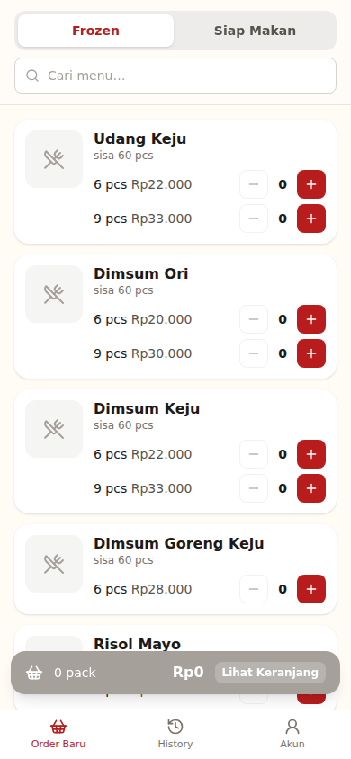
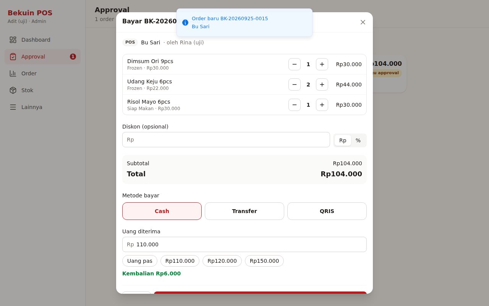
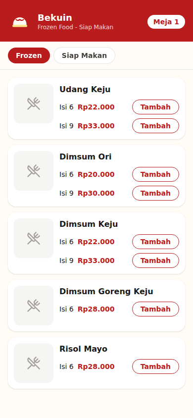
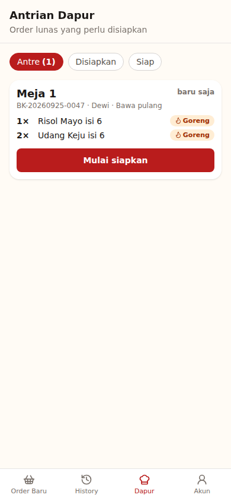
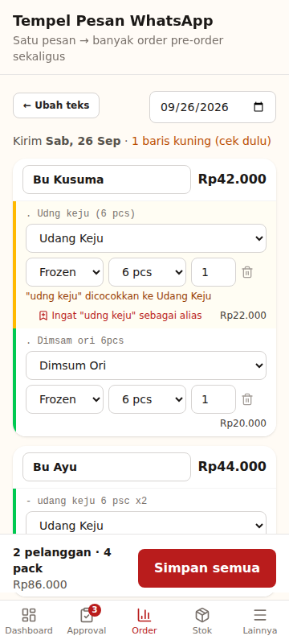
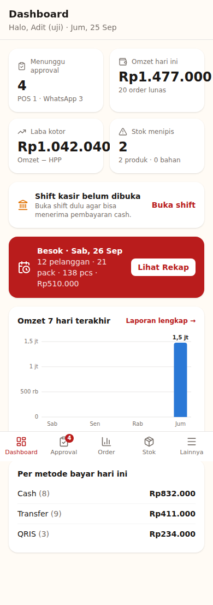
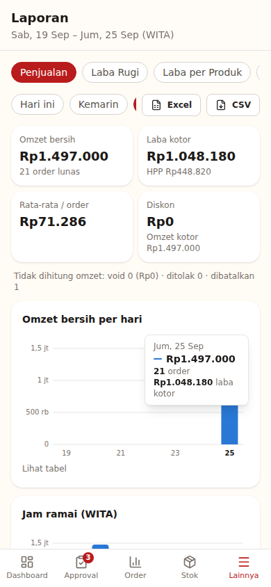
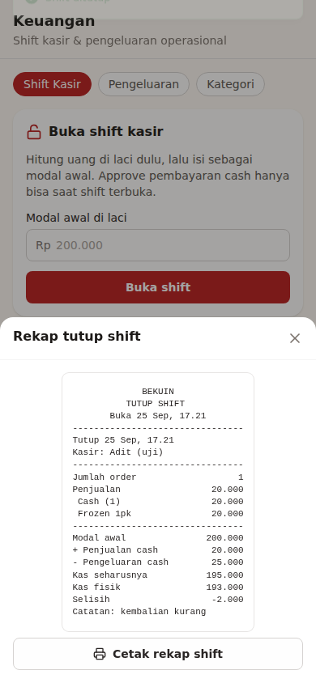
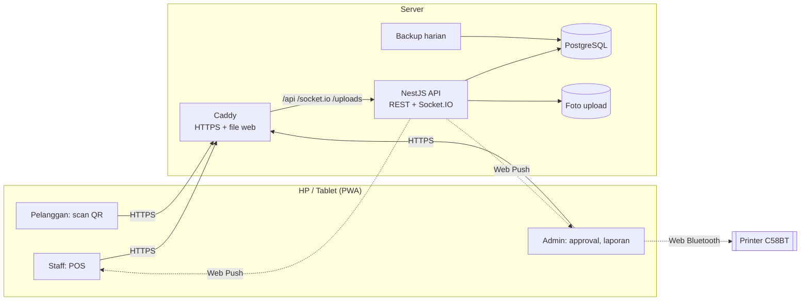
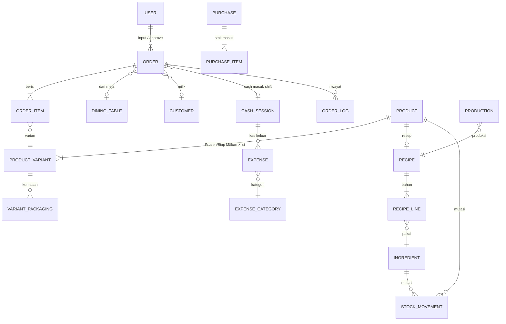

# Bekuin POS

Sistem order, approval, self-order QR meja, stok berbasis resep, HPP, dan laporan keuangan untuk usaha dimsum **Bekuin** (Frozen & Siap Makan). Aplikasi web (PWA) yang bisa dipasang di HP, dan mencetak struk ke printer thermal Bluetooth 58mm (Axelpos/Iware C58BT).

Spesifikasi lengkap ada di [PRD.md](PRD.md).

## Fitur

**Staff (POS)**
- Layar order cepat per kategori Frozen / Siap Makan, keranjang tersimpan walau HP mati, tanggal kirim (hari ini/besok/pre-order)
- Tempel pesan WhatsApp → otomatis jadi banyak order (parser dengan koreksi ejaan)
- Riwayat order sendiri + notifikasi saat order di-approve/ditolak, antrian dapur

**Admin**
- Approval realtime (bunyi + badge): koreksi item, diskon, bayar Cash (kembalian) / QRIS / Transfer, cetak struk, approve massal
- Menu & harga, meja & QR, pengguna, metode bayar, pengaturan toko & jam buka
- Bahan baku, resep bertingkat, **HPP & margin otomatis**; stok masuk, produksi, opname, waste
- Rekap produksi pre-order (daftar belanja, adonan per batch), packing & tagihan, data pelanggan
- **Keuangan:** shift kasir (modal, kas seharusnya, selisih), pengeluaran + foto nota
- **Laporan:** penjualan, laba rugi, laba per produk, produk terlaris, arus kas, mutasi stok, shift, layanan QR, rekap harian (cetak 58mm), export Excel/CSV, grafik 7 hari di dashboard

**Pelanggan (tanpa akun)**
- Scan QR di meja → pesan → bayar QRIS (unggah bukti) atau di kasir → lacak status realtime sampai pesanan siap

## Tampilan

| POS staff | Approval admin | Menu pelanggan (QR) | Antrian dapur |
| --- | --- | --- | --- |
|  |  |  |  |

| Tempel pesan WA | Dashboard | Laporan | Tutup shift |
| --- | --- | --- | --- |
|  |  |  |  |

## Arsitektur



Aturan inti:
- Semua order (POS, QR, WhatsApp) masuk **PENDING**. Stok baru terpotong saat admin approve, dalam satu transaksi.
- Harga & total selalu dihitung ulang di server.
- Stok hanya diubah lewat `StockService` (kunci baris + catatan mutasi).
- Uang disimpan sebagai rupiah bulat. Tanggal bisnis memakai WITA (Asia/Makassar).

### Data utama



Skema lengkap (30 tabel): [apps/api/prisma/schema.prisma](apps/api/prisma/schema.prisma).

## Stack

React 19 + Vite 7 + Tailwind 4 (PWA, TanStack Query, Zustand) · NestJS 11 · PostgreSQL 16 + Prisma 6 · Socket.IO · Web Push · TypeScript · pnpm monorepo

```
apps/api          NestJS REST API + Prisma (schema, migrasi, seeder), Dockerfile
apps/web          React PWA: staff (POS), admin, pelanggan (QR), Dockerfile (Caddy)
packages/shared   Enum, tipe, skema Zod, util format (dipakai API & web)
deploy/           Caddyfile, contoh .env produksi, skrip backup
scripts/          backup-now.sh, restore-db.sh
docs/             SETUP, DEPLOY, SECURITY, fixture parser WhatsApp, screenshot
```

## Menjalankan di laptop

Butuh Node.js 22, pnpm 10, dan Docker Desktop. Langkah dari nol untuk Windows ada di [docs/SETUP.md](docs/SETUP.md).

```bash
pnpm install
cp apps/api/.env.example apps/api/.env
cp apps/web/.env.example apps/web/.env
pnpm db:up          # PostgreSQL di Docker
pnpm db:migrate     # buat tabel
pnpm db:seed        # data awal Bekuin + stok demo
pnpm dev            # API :3000, web :5173
```

- Web: http://localhost:5173 (dari HP di WiFi yang sama: `http://<IP-laptop>:5173`)
- Swagger: http://localhost:3000/api/docs

**Akun demo** (dari seeder; wajib ganti password saat login pertama):

| Role | Username | Password awal |
| --- | --- | --- |
| Admin | `admin` | `admin12345` |
| Staff | `staff` | `staff12345` |

Pelanggan: buka **Lainnya → Meja & QR**, lalu klik link/scan QR salah satu meja.

## Perintah

| Perintah | Fungsi |
| --- | --- |
| `pnpm dev` | API + web + shared (watch) |
| `pnpm lint` / `pnpm format` / `pnpm typecheck` | Kualitas kode |
| `pnpm test` | Unit test (stok, HPP, harga, parser WA, rekap produksi, laporan, push) |
| `pnpm --filter @bekuin/api test:e2e` | Test end-to-end ke database asli |
| `pnpm build` | Build produksi |
| `pnpm db:migrate` / `db:seed` / `db:reset` / `db:studio` | Database |
| `pnpm --filter @bekuin/api push:keys` | Buat VAPID key untuk notifikasi push |

## Deploy & operasional

- **Deploy ke internet (HTTPS):** [docs/DEPLOY.md](docs/DEPLOY.md). Satu VPS dengan `docker-compose.prod.yml` (disarankan), atau Railway + Neon + Vercel.
- **Backup harian & restore:** [docs/DEPLOY.md#backup--restore](docs/DEPLOY.md#backup--restore)
- **Keamanan:** [docs/SECURITY.md](docs/SECURITY.md)
- **Parser WhatsApp:** contoh pesan & hasil di [docs/fixtures](docs/fixtures). Ganti contoh dengan chat asli agar aturan parser teruji pada format pelanggan Anda.

## Status

Semua sprint PRD (0–8) sudah dikerjakan. Checklist ada di [PRD.md bagian 10](PRD.md#10-task-breakdown). Yang tersisa adalah langkah di lapangan: sewa VPS/domain, cetak & tempel QR meja, pelatihan staff, dan video demo.
